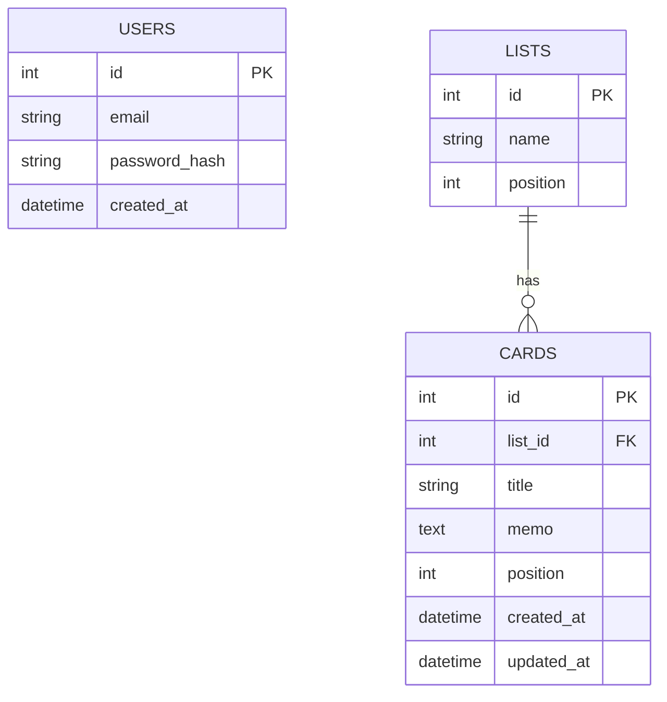

# ER図

## テーブル定義

---

## テーブル説明

### USERS（ユーザー）
| カラム名 | 型 | 説明 |
|----------|----|------|
| id | int | 主キー |
| email | string | メールアドレス（ログインに使用） |
| password_hash | string | ハッシュ化されたパスワード |
| created_at | datetime | 登録日時 |

### LISTS（リスト）
| カラム名 | 型 | 説明 |
|----------|----|------|
| id | int | 主キー |
| name | string | リスト名（「To Do」「進行中」「完了」） |
| position | int | 表示順（左から1, 2, 3） |

### CARDS（カード）
| カラム名 | 型 | 説明 |
|----------|----|------|
| id | int | 主キー |
| list_id | int | 所属するリストのID（外部キー） |
| title | string | カードのタイトル |
| memo | text | テキストメモ |
| position | int | リスト内の表示順 |
| created_at | datetime | 作成日時 |
| updated_at | datetime | 更新日時 |

---

## リレーション説明

- **LISTS → CARDS**：1つのリストは複数のカードを持てる（1対多）
- **USERS**：今回は1人しか使わないため他テーブルとの関連なし
